# EAP - SubTracker

## 1. Visão geral
A Estrutura Analítica do Projeto (EAP) do SubTracker foi reestruturada para refletir o escopo da versão 1, conforme o Termo de Abertura, a Fonte de Verde e as respostas do grupo. A EAP está alinhada ao produto e ao projeto, sem incluir Cobranças nem manutenção de Categorias como módulos independentes.

## 2. Estrutura analítica do projeto

```mermaid
flowchart TD
    root["1 SubTracker"]

    root --> p1["1.1 Gerenciamento do Projeto"]
    root --> p2["1.2 Prototipagem e Requisitos"]
    root --> p3["1.3 Client-Side"]
    root --> p4["1.4 Server-Side"]
    root --> p5["1.5 Integração, Testes e Validação"]
    root --> p6["1.6 Encerramento"]

    p1 --> p1a["1.1.1 Documentação e acompanhamento do projeto"]
    p1 --> p1b["1.1.2 Monitoramento, riscos e comunicação"]

    p2 --> p2a["1.2.1 Levantamento, priorização e rastreabilidade"]
    p2 --> p2b["1.2.2 Prototipagem e matrizes de requisitos"]

    p3 --> p3a["1.3.1 Estrutura de front-end e rotas"]
    p3 --> p3b["1.3.2 Assinaturas e dashboard"]
    p3 --> p3c["1.3.3 Serviços e cancelamento"]
    p3 --> p3d["1.3.4 Tetos e consumo orçamentário"]
    p3 --> p3e["1.3.5 Extratos, histórico e conciliação"]
    p3 --> p3f["1.3.6 Relatório e tutorial"]

    p4 --> p4a["1.4.1 Estrutura da API e modelagem do banco"]
    p4 --> p4b["1.4.2 API de Assinaturas"]
    p4 --> p4c["1.4.3 API de Serviços"]
    p4 --> p4d["1.4.4 API de Tetos"]
    p4 --> p4e["1.4.5 Importação de extratos e conciliação"]
    p4 --> p4f["1.4.6 Relatório, projeção e acesso"]

    p5 --> p5a["1.5.1 Integração front-end/back-end"]
    p5 --> p5b["1.5.2 Testes de validação funcional"]
    p5 --> p5c["1.5.3 Ajustes e validação final"]

    p6 --> p6a["1.6.1 Documentação final e entrega"]
```

## 3. Tabela resumida da EAP

| Código | Elemento | Nível | Responsável | Origem (UC/requisito) |
| ------ | -------- | ----- | ----------- | --------------------- |
| 1 | SubTracker | Projeto | Gerência + equipe de desenvolvimento | Projeto acadêmico SubTracker |
| 1.1 | Gerenciamento do Projeto | Entrega | Gerência | Business Case, Termo de Abertura, Plano de Projeto |
| 1.1.1 | Documentação e acompanhamento do projeto | Pacote | Gerência | Requisitos de gestão |
| 1.1.2 | Monitoramento, riscos e comunicação | Pacote | Gerência | Riscos do Termo de Abertura |
| 1.2 | Prototipagem e Requisitos | Entrega | Ronald, Rodrigo, Thiago | UC01–UC18 e protótipo |
| 1.2.1 | Levantamento, priorização e rastreabilidade | Pacote | Ronald, Rodrigo, Thiago | UC01–UC18 |
| 1.2.2 | Prototipagem e matrizes de requisitos | Pacote | Ronald, Rodrigo, Thiago | Prototipagem, CRUD, perfil x funcionalidade |
| 1.3 | Client-Side | Entrega | Ronald, Rodrigo, Thiago | UC01–UC18 |
| 1.3.1 | Estrutura de front-end e rotas | Pacote | Ronald | UC01–UC18 |
| 1.3.2 | Assinaturas e dashboard | Pacote | Ronald | UC01–UC04, UC17 |
| 1.3.3 | Serviços e cancelamento | Pacote | Thiago | UC05–UC08, UC18 |
| 1.3.4 | Tetos e consumo orçamentário | Pacote | Equipe de desenvolvimento | UC09–UC12 |
| 1.3.5 | Extratos, histórico e conciliação | Pacote | Rodrigo | UC13–UC16 |
| 1.3.6 | Relatório e tutorial | Pacote | Ronald e Thiago | UC17–UC18 |
| 1.4 | Server-Side | Entrega | Ronald, Rodrigo, Thiago | UC01–UC18 |
| 1.4.1 | Estrutura da API e modelagem do banco | Pacote | Rodrigo | Requisito de alto nível |
| 1.4.2 | API de Assinaturas | Pacote | Ronald | UC01–UC04 |
| 1.4.3 | API de Serviços | Pacote | Thiago | UC05–UC08 |
| 1.4.4 | API de Tetos | Pacote | Equipe de desenvolvimento | UC09–UC12 |
| 1.4.5 | Importação de extratos e conciliação | Pacote | Rodrigo | UC13–UC16 |
| 1.4.6 | Relatório, projeção e acesso | Pacote | Ronald e Thiago | UC17–UC18 |
| 1.5 | Integração, Testes e Validação | Entrega | Ronald, Rodrigo, Thiago | UC01–UC18 |
| 1.5.1 | Integração front-end/back-end | Pacote | Ronald, Rodrigo, Thiago | Integridade do sistema |
| 1.5.2 | Testes de validação funcional | Pacote | Ronald, Rodrigo, Thiago | UC01–UC18 |
| 1.5.3 | Ajustes e validação final | Pacote | Ronald, Rodrigo, Thiago | Critérios de sucesso |
| 1.6 | Encerramento | Entrega | Gerência + equipe | Entregas finais |
| 1.6.1 | Documentação final e entrega | Pacote | Gerência | Encerramento do projeto |

## 4. Observações sobre o escopo
- O escopo da versão 1 foi mantido em UC01–UC18, conforme a Fonte de Verde, sem incluir Cobranças como módulo próprio.
- Categoria ficou como domínio-base com seed populado, e não como módulo de manutenção.
- O histórico de cobranças permanece vinculado à Assinatura, conforme resposta do grupo.
- A EAP foi estruturada em entregas de produto e projeto, seguindo o critério de decomposição da disciplina.

## 5. Registro de uso de IA

| O que foi sugerido | Decisão do grupo (aceito/recusado) | Justificativa |
| ------------------ | ---------------------------------- | ------------- |
| Revisão da estrutura da EAP para refletir o escopo da versão 1 |  |  |
| Agrupar e alinhar UC05–UC08 com cancelamento e serviços |  |  |
| Manter Categoria como seed, sem módulo de manutenção |  |  |
| Remover Cobranças e manutenção de Categorias do escopo da versão 1 |  |  |
| Ajustar a EAP para refletir o estado real do repositório e os riscos do Termo |  |  |
