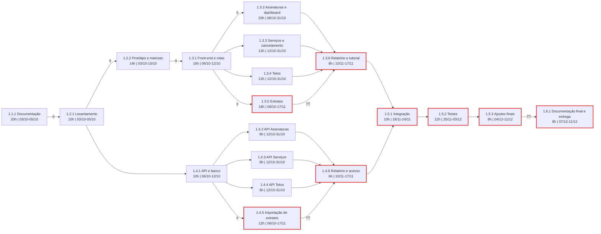

# Plano do Projeto

# SubTracker

**Gestão Inteligente de Assinaturas, Detecção por Extrato e Otimização de Recorrências**

| | |
|---|---|
| **Versão** | 3.0 (substitui a v2.0) |
| **Data** | 04/10/2026 |
| **Disciplinas** | Programação de Software Web (PSW) e Gerenciamento de Projetos de TI (GPTI), CEFET/RJ |
| **Patrocinador** | Diogo Silveira Mendonça |
| **Gerência do projeto (GPTI)** | Davi Luiz Rodrigues da Conceição, João Henrique Lima Gualberto, Michael Patrick Ferreira da Silva Borba e Vinicius da Silva Mendes |
| **Equipe de desenvolvimento (PSW)** | Ronald Teixeira de Assis, Rodrigo Américo Nascimento D'Icarahy e Thiago Souza da Silva |
| **Repositório** | https://github.com/SouzTH/SubTracker |
| **Documentos que este plano consolida** | Business Case v2.0 (03/10/2026), EAP e Dicionário da EAP v2.0 (03/10/2026) |

> **Como ler este plano.** O Plano **não repete** o que já está definido nos documentos-base; ele os integra e aponta a fonte. Em caso de divergência, vale a regra: **EAP e Dicionário** definem o trabalho (pacotes, esforço, datas, responsáveis); o **Business Case** define a justificativa, os objetivos de negócio, o patrocinador e a lógica de custo; **este Plano** define como tudo isso é gerenciado (prazo, custo, recursos, partes interessadas, riscos, controle).
>
> Itens marcados com **[confirmar]** dependem de informação que não consta nos documentos e devem ser validados pela equipe. As divergências encontradas entre os documentos e o tratamento dado a cada uma estão no **Anexo A**; o que mudou em relação à v2.0 está no **Anexo B**.

---

# Sumário

1. Introdução
2. Escopo do Projeto
3. Estrutura Analítica do Projeto (EAP)
4. Dicionário da EAP (resumo)
5. Cronograma
6. Rede de Atividades
7. Orçamento (esforço e custo)
8. Recursos do Projeto
9. Partes Interessadas
10. Plano de Engajamento
11. Plano de Comunicação (Cadência)
12. Gerenciamento de Riscos
13. Controle e Monitoramento
14. Encerramento do Projeto
15. Uso de Inteligência Artificial na Elaboração do Plano

Anexo A. Divergências entre documentos e decisões pendentes
Anexo B. Registro de alterações em relação à v2.0

---

# 1. Introdução

## 1.1 Objetivo do Plano

Descrever como o projeto SubTracker será planejado, executado, monitorado e encerrado, integrando em um único plano o escopo, o prazo, o esforço e custo, os recursos, as partes interessadas e os riscos. O plano cresce por elaboração progressiva: será atualizado sempre que uma mudança aprovada alterar uma das linhas de base.

## 1.2 Visão Geral do Projeto

**Problema.** A proliferação de serviços por assinatura (streaming, academias, softwares, armazenamento em nuvem, jogos) fragmenta as cobranças ao longo do mês. O usuário perde a visão do total comprometido e é surpreendido por débitos recorrentes de serviços que quase não usa. O Business Case (seção 2) documenta isso com dados de pesquisa: entre os que já cancelaram algum serviço, 39% apontaram a sensação de não aproveitar a assinatura como deveriam.

**Proposta de valor (Business Case, seções 1 e 3).** O SubTracker unifica as assinaturas em uma visão cronológica e previsível e passa a:

- **Detectar assinaturas por extrato:** lê extratos bancários em CSV, cruza as descrições com o catálogo de provedores e apresenta as recorrências encontradas para confirmação em lote;
- **Controlar tetos orçamentários:** metas de gasto por categoria, com barras de progresso no painel;
- **Facilitar o cancelamento:** link direto e orientações para cancelar na plataforma do provedor (o cancelamento é sempre conduzido pelo usuário);
- **Emitir relatório de impacto:** distribuição por categoria, ranking, projeção mensal e custo anual.

**Produto.** Aplicação web responsiva (mobile-first) com 5 entidades de domínio (Assinatura, Serviço, Categoria, Extrato Importado e Teto Orçamentário), 18 casos de uso (UC01 a UC18), 2 perfis de acesso (Usuário e Administrador) e protótipo de 7 telas.

**Situação atual (Business Case, seção 5; Dicionário, seção 5).** O repositório tem front-end em React 19, Vite e TypeScript, com dados simulados por `json-server` (`db.json`), autenticação simulada e importação de extrato em CSV; **13 dos 18 casos de uso** estão implementados. Não há back-end real, banco relacional, hospedagem em produção nem leitura de OFX. A situação de **UC05, UC07, UC08, UC15 e UC16 depende de decisão do patrocinador** (Anexo A, D3).

**Cobertura do plano.** Do início previsto em 03/10/2026 à entrega final, na segunda semana de dezembro de 2026 (07 a 11/12/2026).

## 1.3 Abordagem e Ciclo de Vida

**Abordagem híbrida** (proposta):

- **Preditiva** no que é estável: escopo, EAP, esforço por pacote, marcos e a data da entrega final, que é fixa por ser trabalho acadêmico;
- **Adaptativa** no desenvolvimento: cada módulo (pacotes 1.3.2 a 1.3.5 no front-end e 1.4.2 a 1.4.5 na API) é construído e demonstrado em incrementos, na ordem de prioridade da seção 2.2, e pode ser refinado a partir do retorno da equipe e dos usuários.

## 1.4 Premissas Gerais

| # | Premissa | Fonte | Se for falsa, vira o risco |
|---|----------|-------|----------------------------|
| P1 | Há extratos de teste sintéticos em CSV, de pelo menos 3 layouts diferentes e com 10 ou mais lançamentos, disponíveis desde o início de 1.3.5 e 1.4.5. | Business Case (O2) | R1 |
| P2 | A dedicação é de **4 h por semana por pessoa** (3 desenvolvedores e 4 gerentes), sem considerar provas e feriados. | Dicionário, seção 5 | R2 |
| P3 | O modelo de dados é congelado ao final de 1.4.1 (12/10/2026); mudanças posteriores passam por controle de mudanças. | Plano | R7 |
| P4 | Para contar dias úteis (DU), o Plano desconta sábados, domingos e os feriados de 12/10, 02/11 e 20/11/2026. As datas do Dicionário foram mantidas. | Plano | R7 |
| P5 | A infraestrutura é acadêmica e sem custo real de produção (cenário A: Vercel Hobby e Supabase Free); o caixa é R$ 0,00. | Dicionário, seção 4; Business Case, seção 8.2 | Orçamento |
| P6 | **A linha de base de esforço (228 h) pressupõe back-end simulado em `json-server`**, como descrevem os pacotes 1.4.x e 1.5.1 do Dicionário. Back-end real com banco exigiria mudança de escopo. | Dicionário | R4 |
| P7 | A linha de base de importação de extratos é **CSV**. Leitura de OFX não está implementada e fica fora da linha de base até decisão do patrocinador. | Dicionário (1.3.5, 1.4.5); Business Case (seção 5) | R1, R6 |
| P8 | As estimativas de esforço são por julgamento, sem base histórica de projetos anteriores. | Business Case, seção 8.2 | R2, R7 |
| P9 | Matheus não integra o desenvolvimento; a equipe é a descrita no cabeçalho. | Dicionário, seção 5 | R3 |

---

# 2. Escopo do Projeto

## 2.1 Objetivo

Entregar, até a segunda semana de dezembro de 2026 (Marco 3, 07 a 11/12/2026), um sistema web mobile-first que detecta assinaturas a partir de extratos bancários em CSV, centraliza o seu acompanhamento, monitora tetos de gasto por categoria e leva o usuário à página de cancelamento do provedor, com toda a documentação do projeto. Os objetivos de negócio mensuráveis estão no Business Case (seção 4, O1 a O5) e são verificados pelos critérios de aceite da seção 2.4 deste plano.

## 2.2 Requisitos

Cada requisito descreve uma **necessidade**, não uma solução, e está ligado à sua origem (casos de uso), ao objetivo do Business Case e aos pacotes da EAP que o entregam (rastreabilidade). A prioridade segue o refinamento da prototipagem.

| ID | Requisito (necessidade) | Tipo | Origem | Objetivo (BC) | Pacotes (EAP) | Prioridade |
|----|-------------------------|------|--------|:-------------:|---------------|------------|
| RQ01 | O usuário precisa ver, em uma só tela, o total gasto no mês, as próximas cobranças em ordem de vencimento e o consumo frente às metas. | Negócio / Usuário | UC02 | O3 | 1.3.2, 1.3.4 | Média |
| RQ02 | O usuário precisa que o sistema identifique assinaturas recorrentes a partir do extrato bancário, sem digitar uma a uma, e confirme em lote o que foi encontrado. | Funcional | UC13, UC14, UC15, UC16 | O2 | 1.3.5, 1.4.5 | **Máxima** |
| RQ03 | O usuário precisa cadastrar uma assinatura manualmente (valor, periodicidade, próxima cobrança, categoria e forma de pagamento), consultá-la com o histórico de cobranças, pausá-la, editá-la ou excluí-la. O histórico de cobranças pertence à Assinatura; não há tabela de Cobrança. | Funcional | UC01, UC02, UC03, UC04 | O1 | 1.3.2, 1.4.2 | Média / Básica |
| RQ04 | O usuário precisa definir um teto de gasto por categoria e acompanhar o quanto já foi consumido. | Funcional | UC09, UC10, UC11, UC12 | O1 | 1.3.4, 1.4.4 | Média / Básica |
| RQ05 | O usuário precisa chegar à página de cancelamento do provedor a partir da assinatura; o administrador precisa manter o catálogo de provedores e esses links. | Funcional | UC05, UC06, UC07, UC08, UC18 | O1 | 1.3.3, 1.4.3, 1.3.6 | **Máxima** / Básica |
| RQ06 | O usuário precisa entender o impacto financeiro das assinaturas: distribuição por categoria, ranking, projeção do mês seguinte e custo anual. | Funcional | UC17 | O3 | 1.3.6, 1.4.6 | **Máxima** |
| RQ07 | O sistema deve ser usável no celular, com fluxos em etapas curtas, e ter perfis de acesso distintos (Usuário e Administrador). | Não funcional | Matriz Perfil × Funcionalidade; protótipo | O1, O3 | 1.3.1, 1.4.6 | Média |
| RQ08 | O sistema só aceita extratos em CSV (baseline), não processa pagamentos e não se conecta diretamente a bancos ou cartões. | Restrição | UC13; exclusões de escopo | — | 1.3.5, 1.4.5 | — |

**Nota de rastreabilidade.** A EAP e o Dicionário atribuem UC17 e UC18 a mais de um pacote (UC17 em 1.3.2 e 1.3.6; UC18 em 1.3.3 e 1.3.6). Este plano trata **1.3.6 e 1.4.6 como pacotes principais de UC17 e UC18**, e 1.3.2 e 1.3.3 como fornecedores dos dados (painel e links). Ajuste recomendado nos documentos-base no Anexo A.

## 2.3 Declaração do Escopo

**Escopo do produto.** O que o sistema faz: cadastro e acompanhamento de assinaturas, importação e conciliação de extratos CSV, catálogo de provedores com atalho de cancelamento, tetos orçamentários por categoria e relatório de impacto financeiro (UC01 a UC18).

**Escopo do projeto.** O trabalho necessário para entregar o produto, conforme a EAP: gerenciamento, prototipagem e requisitos, client-side, server-side, integração, testes e validação, e encerramento.

**Entregas principais**

1. **Gerenciamento (1.1):** Business Case, Termo de Abertura, Plano do Projeto, EAP, Dicionário, registro de riscos, plano de comunicação e registros de acompanhamento.
2. **Prototipagem e requisitos (1.2):** matriz de priorização, matriz UC × requisito, protótipo de 7 telas, matrizes CRUD e Perfil × Funcionalidade.
3. **Client-side (1.3) e server-side (1.4):** sistema SubTracker com os cinco módulos (Assinaturas, Serviços, Tetos, Extratos, Relatório) e a estrutura de API e banco.
4. **Integração, testes e validação (1.5):** fluxo integrado, checklist de testes com evidências e sistema ajustado.
5. **Encerramento (1.6):** documentação final e entrega.

## 2.4 Exclusões de Escopo

- **Integração bancária direta** (API, Open Finance) e **integração com cartões**: o sistema só lê arquivos enviados pelo usuário.
- **Leitura de arquivos OFX:** fora da linha de base até decisão do patrocinador (Anexo A, D2).
- **Processamento de pagamentos** e dados de cartão.
- **Cancelamento automático em nome do usuário:** o sistema apenas redireciona e orienta (UC18).
- **Sincronização com serviços externos.**
- **Manutenção de categorias pela interface:** Categoria é domínio-base com seed populado (Streaming, Trabalho, Fitness, Música, Jogos, Outros).
- **Tabela própria de Cobranças:** o histórico fica vinculado à Assinatura.
- **Aplicativo móvel nativo:** a entrega é uma aplicação web mobile-first.
- **Monetização (cobrança do SubTracker):** decisão adiada para depois do Marco 3 (Business Case, seção 11).

## 2.5 Critérios de Aceite Gerais

Os critérios abaixo verificam os objetivos O1 a O4 do Business Case e são exercitados no pacote 1.5.2.

| # | Critério | Objetivo (BC) | Pacote que verifica |
|---|----------|:-------------:|---------------------|
| 1 | **Importação:** em extrato CSV de teste com pelo menos 10 lançamentos, o sistema reconhece **80% ou mais** das assinaturas do catálogo presentes; após a confirmação em lote, elas aparecem no painel; layout incompatível é rejeitado com mensagem clara. | O2 | 1.3.5, 1.4.5, 1.5.2 |
| 2 | **Painel:** exibe o total do mês, as próximas cobranças em ordem de vencimento e, por categoria, a barra de consumo frente ao teto, que muda de cor ao ultrapassá-lo. | O1 | 1.3.2, 1.3.4, 1.5.2 |
| 3 | **Cancelamento:** na tela de detalhes de qualquer assinatura de um serviço do catálogo, o botão "Cancelar no Provedor" abre a página cadastrada para aquele serviço. | O1 | 1.3.3, 1.3.6, 1.5.2 |
| 4 | **Relatório:** o custo anual projetado é coerente com os dados cadastrados (por exemplo, R$ 491,60 por mês geram R$ 5.899,20 por ano) e a distribuição por categoria soma 100%. | O1 | 1.3.6, 1.4.6, 1.5.2 |
| 5 | **Clareza:** em teste com 5 usuários-alvo, pelo menos 4 encontram o total mensal e a projeção anual em até 30 segundos. | O3 | 1.5.2 |
| 6 | **Integração:** os UC01 a UC18 do escopo aprovado funcionam de ponta a ponta entre front-end, API e dados (CRUD e importação). A definição de "API e dados" depende da decisão D1. | O1 | 1.5.1, 1.5.2 |
| 7 | **Esforço e custo:** esforço realizado dentro da linha de base da seção 7 e desembolso de caixa de R$ 0,00. | O4 | 1.1.2 |

## 2.6 Gerenciamento do Escopo

- **Quem valida regras de negócio:** o patrocinador (Diogo Silveira Mendonça).
- **Quem aprova mudança de escopo:** qualquer integrante pode propor; a gerência e a equipe de desenvolvimento avaliam o impacto em escopo, prazo e esforço; o patrocinador aprova. O que não consta nesta declaração não entra sozinho.
- **Aceite:** é dado por pacote da EAP, conforme os critérios do Dicionário, e não por tela isolada.
- **Linha de base do escopo:** declaração (seção 2.3) + EAP (seção 3) + Dicionário (seção 4 e documento completo). Só muda por controle formal de mudanças.

---

# 3. Estrutura Analítica do Projeto (EAP)

Reprodução da EAP do projeto (documento `EAP.md`), decomposta por **entrega**, misturando produto e projeto. Os pacotes de trabalho são as folhas de três níveis (1.x.y); não há datas nem horas nesta estrutura.

```text
1 SubTracker
│
├── 1.1 Gerenciamento do Projeto
│   ├── 1.1.1 Documentação e acompanhamento do projeto
│   └── 1.1.2 Monitoramento, riscos e comunicação
│
├── 1.2 Prototipagem e Requisitos
│   ├── 1.2.1 Levantamento, priorização e rastreabilidade
│   └── 1.2.2 Prototipagem e matrizes de requisitos
│
├── 1.3 Client-Side
│   ├── 1.3.1 Estrutura de front-end e rotas
│   ├── 1.3.2 Assinaturas e dashboard
│   ├── 1.3.3 Serviços e cancelamento
│   ├── 1.3.4 Tetos e consumo orçamentário
│   ├── 1.3.5 Extratos, histórico e conciliação
│   └── 1.3.6 Relatório e tutorial
│
├── 1.4 Server-Side
│   ├── 1.4.1 Estrutura da API e modelagem do banco
│   ├── 1.4.2 API de Assinaturas
│   ├── 1.4.3 API de Serviços
│   ├── 1.4.4 API de Tetos
│   ├── 1.4.5 Importação de extratos e conciliação
│   └── 1.4.6 Relatório, projeção e acesso
│
├── 1.5 Integração, Testes e Validação
│   ├── 1.5.1 Integração front-end/back-end
│   ├── 1.5.2 Testes de validação funcional
│   └── 1.5.3 Ajustes e validação final
│
└── 1.6 Encerramento
    └── 1.6.1 Documentação final e entrega
```

**Totais:** 6 entregas e 20 pacotes de trabalho. Os códigos desta seção são os mesmos usados em todo o plano (cronograma, orçamento, RAM e riscos).

---

# 4. Dicionário da EAP (resumo)

O Dicionário completo (`Dicionário da EAP.md`, v2.0) detalha, para cada pacote: descrição do trabalho, entregas, responsável, datas, marco, critérios de aceitação, dependências, recursos, custo em horas, premissas e riscos. **Este plano usa esses valores como linha de base.** A tabela abaixo é um resumo para consulta; havendo diferença, vale o Dicionário.

| Pacote | Entregas (resumo) | Critério de aceite (resumo) | Responsável (Dicionário) | Esforço (h) | Marco |
|--------|-------------------|-----------------------------|--------------------------|:-----------:|:-----:|
| **1.1.1** Documentação e acompanhamento | Business Case, Termo, Plano, EAP e Dicionário; registros de acompanhamento | Documentos revisados e consistentes com o escopo; aprovação do patrocinador/gerência | Gerência | 20 | 1 |
| **1.1.2** Monitoramento, riscos e comunicação | Registro de riscos, plano de comunicação, indicadores, replanejamento | Riscos atualizados, cronograma acompanhado e comunicação registrada | Gerência | 12 | 1, 2, 3 |
| **1.2.1** Levantamento, priorização e rastreabilidade | Matriz de priorização, matriz UC × requisito, lista de requisitos | UC01 a UC18 mapeados e priorização confirmada pela equipe | Ronald, Rodrigo, Thiago | 10 | 1 |
| **1.2.2** Prototipagem e matrizes | Protótipo de 7 telas, matrizes CRUD e Perfil × Funcionalidade | Prototipagem concluída e consistente com o fluxo e os UCs | Ronald, Rodrigo, Thiago | 14 | 1 |
| **1.3.1** Estrutura de front-end e rotas | Projeto React/Vite/TS, rotas e layout base | Rotas navegáveis e layout base estável | Ronald | 16 | 2 |
| **1.3.2** Assinaturas e dashboard | Painel, formulário, listagem, edição e detalhe | UC01 a UC04 operacionais no front-end | Ronald | 20 | 2 |
| **1.3.3** Serviços e cancelamento | Cadastro e consulta de serviços, links e orientações de cancelamento | UC05 a UC08 na interface, com fluxo de cancelamento informado | Thiago | 12 | 2 |
| **1.3.4** Tetos e consumo | Formulário de tetos, visão de consumo, indicadores | UC09 a UC12 operacionais, com indicadores de consumo | Equipe de desenvolvimento | 12 | 2 |
| **1.3.5** Extratos, histórico e conciliação | Importação, histórico, conciliação e descarte | UC13 a UC16 funcionais; aceita CSV e rejeita layouts incompatíveis | Rodrigo | 16 | 2 |
| **1.3.6** Relatório e tutorial | Tela de relatório, projeção de impacto, tutorial com link de cancelamento | UC17 e UC18 acessíveis e úteis à decisão do usuário | Ronald e Thiago | 8 | 2 |
| **1.4.1** Estrutura da API e modelagem do banco | Estrutura da API, entidades e dados de referência | Estrutura alinhada aos UCs e ao modelo do repositório | Rodrigo | 10 | 2 |
| **1.4.2** API de Assinaturas | Endpoints, regras de edição, eventos de status | UC01 a UC04 atendidos pelos endpoints e pela persistência | Ronald | 8 | 2 |
| **1.4.3** API de Serviços | API, links de cancelamento, catálogo-base | UC05 a UC08 atendidos, com catálogo e orientação | Thiago | 8 | 2 |
| **1.4.4** API de Tetos | Endpoints e dados de tetos | UC09 a UC12 consistentes com consumo e categoria | Equipe de desenvolvimento | 6 | 2 |
| **1.4.5** Importação de extratos e conciliação | Upload, processamento, histórico e descarte | UC13 a UC16 atendidos, com leitura de CSV, histórico e descarte | Rodrigo | 12 | 2 |
| **1.4.6** Relatório, projeção e acesso | Métricas de projeção, relatórios, controle de acesso | UC17 e UC18 atendidos, com projeção e links | Ronald e Thiago | 6 | 2 |
| **1.5.1** Integração front-end/back-end | Fluxo integrado de dados | CRUD e importação corretos de ponta a ponta | Ronald, Rodrigo, Thiago | 10 | 3 |
| **1.5.2** Testes de validação funcional | Checklist, evidências e correções | Fluxos principais e críticos concluídos, sem divergência importante com o escopo | Ronald, Rodrigo, Thiago | 12 | 3 |
| **1.5.3** Ajustes e validação final | Sistema ajustado, registros de correção | Sistema estável e documentação alinhada à versão entregue | Ronald, Rodrigo, Thiago | 8 | 3 |
| **1.6.1** Documentação final e entrega | Documentação final, EAP e Dicionário finalizados, repositório atualizado | Entregas revisadas e consistentes com a versão entregue | Gerência + equipe | 8 | 3 |
| | | | **Total dos pacotes** | **228** | |

---

# 5. Cronograma

## 5.1 Gerenciamento do Prazo

- **Unidade:** dia útil (DU). Início previsto em 03/10/2026; marcos conforme o Dicionário.
- **Calendário:** descontados sábados, domingos e os feriados de 12/10, 02/11 e 20/11/2026 (premissa P4).
- **Fonte das datas:** início e término previstos de cada pacote no Dicionário. As **durações em DU** abaixo são derivadas dessas datas; **esforço (h) e duração são coisas diferentes**: um pacote de 16 h pode durar 6 semanas porque cada pessoa dedica 4 h por semana.
- **Base das estimativas:** julgamento da equipe, sem base histórica (premissa P8). Por isso o Plano não usa estimativa de três pontos, que exigiria dados que não existem.
- **Mudança:** atraso acima de 3 DU em pacote do caminho crítico, ou que consuma a contingência, exige registro de mudança.
- **Acompanhamento:** revisão semanal do cronograma e do caminho crítico.

## 5.2 Cronograma dos Pacotes (linha de base de prazo)

**Tipos de relação:** **TI** = término-início (o sucessor pode começar no dia em que o predecessor termina); **II** = início-início; **TT** = término-término. As relações com II e TT foram explicitadas pelo Plano porque as datas do Dicionário se sobrepõem em alguns pares; elas mantêm as datas do Dicionário e deixam a dependência coerente com elas (Anexo A, D6). A **folga** é a folga livre, calculada a partir das datas previstas.

| Pacote | Predecessoras (tipo) | Esforço (h) | Início | Fim | Duração (DU) | Folga (DU) | Marco |
|--------|----------------------|:-----------:|--------|-----|:------------:|:----------:|:-----:|
| 1.1.1 Documentação e acompanhamento | — | 20 | 03/10 | 05/10 | 1 | 0 | 1 |
| 1.1.2 Monitoramento, riscos e comunicação | 1.1.1 (TI) | 12 | 05/10 | 11/12 | 47 | 0 | 1, 2, 3 |
| 1.2.1 Levantamento e rastreabilidade | 1.1.1 (II) | 10 | 03/10 | 05/10 | 1 | 0 | 1 |
| 1.2.2 Prototipagem e matrizes | 1.2.1 (II) | 14 | 03/10 | 10/10 | 5 | 1 | 1 |
| 1.3.1 Estrutura de front-end e rotas | 1.2.2 (II) | 16 | 06/10 | 12/10 | 4 | 0 | 2 |
| 1.3.2 Assinaturas e dashboard | 1.3.1 (II) | 20 | 06/10 | 31/10 | 18 | 5 | 2 |
| 1.3.3 Serviços e cancelamento | 1.3.1 (TI) | 12 | 12/10 | 31/10 | 14 | 5 | 2 |
| 1.3.4 Tetos e consumo orçamentário | 1.3.1 (TI) | 12 | 12/10 | 31/10 | 14 | 5 | 2 |
| **1.3.5 Extratos, histórico e conciliação** ★ | 1.3.1 (II) | 16 | 06/10 | 17/11 | 29 | 0 | 2 |
| 1.3.6 Relatório e tutorial ★ | 1.3.2, 1.3.3, 1.3.4 (TI); 1.3.5 (TT) | 8 | 10/11 | 17/11 | 6 | 0 | 2 |
| 1.4.1 Estrutura da API e modelagem do banco | 1.2.1 (TI) | 10 | 06/10 | 12/10 | 4 | 0 | 2 |
| 1.4.2 API de Assinaturas | 1.4.1 (TI) | 8 | 12/10 | 31/10 | 14 | 5 | 2 |
| 1.4.3 API de Serviços | 1.4.1 (TI) | 8 | 12/10 | 31/10 | 14 | 5 | 2 |
| 1.4.4 API de Tetos | 1.4.1 (TI) | 6 | 12/10 | 31/10 | 14 | 5 | 2 |
| **1.4.5 Importação de extratos e conciliação** ★ | 1.4.1 (II) | 12 | 06/10 | 17/11 | 29 | 0 | 2 |
| 1.4.6 Relatório, projeção e acesso ★ | 1.4.2, 1.4.3, 1.4.4 (TI); 1.4.5 (TT) | 6 | 10/11 | 17/11 | 6 | 0 | 2 |
| 1.5.1 Integração front-end/back-end ★ | 1.3.2 a 1.3.6 e 1.4.2 a 1.4.6 (TI) | 10 | 18/11 | 24/11 | 4 | 0 | 3 |
| 1.5.2 Testes de validação funcional ★ | 1.5.1 (TI) | 12 | 25/11 | 03/12 | 7 | 0 | 3 |
| 1.5.3 Ajustes e validação final ★ | 1.5.2 (TI) | 8 | 04/12 | 11/12 | 6 | 0 | 3 |
| 1.6.1 Documentação final e entrega ★ | 1.5.3 (TT) | 8 | 07/12 | 11/12 | 5 | 0 | 3 |

★ = no caminho crítico.

## 5.3 Caminho Crítico e Folgas

- **Caminho crítico:** 1.3.5 e 1.4.5 (extratos, 06/10 a 17/11) → 1.3.6 e 1.4.6 (término-término, 17/11) → 1.5.1 → 1.5.2 → 1.5.3 → 1.6.1 (término-término, 11/12). São os pacotes com folga zero que levam à entrega final.
- **Folga de 5 DU** em 1.3.2, 1.3.3, 1.3.4, 1.4.2, 1.4.3 e 1.4.4: terminam em 31/10 e só são necessários em 10/11 (início de 1.3.6 e 1.4.6).
- **Importação de extratos (RQ02, prioridade máxima) está no caminho crítico** e tem a maior incerteza (leitor de CSV, layouts diferentes de bancos). Por isso concentra o risco R1 e o maior valor de contingência (seção 7.5).
- **Não há reserva de prazo** entre o fim de 1.5.3 e a entrega: a única reserva do projeto é a contingência em horas (seção 7.5). Qualquer atraso no caminho crítico atinge diretamente a entrega de 11/12.

## 5.4 Marcos

Datas conforme o Dicionário e o Business Case.

| Marco | Data | O que está concluído | Pacotes |
|-------|------|----------------------|---------|
| **Marco 1** | 05/10/2026 | Documentos de gestão e levantamento de requisitos; Plano do Projeto aprovado. (1.2.2 termina em 10/10; ver Anexo A, D6) | 1.1.1, 1.2.1 |
| **Marco 2** | 17/11/2026 | Estrutura, módulos de front-end e API (assinaturas, serviços, tetos, extratos, relatório) concluídos; demonstração ao patrocinador | 1.2.2, 1.3.1 a 1.3.6, 1.4.1 a 1.4.6 |
| **Marco 3** | 07 a 11/12/2026 (entrega final em 11/12) | Integração, testes, ajustes, documentação final e entrega aprovada | 1.5.1 a 1.5.3, 1.6.1 |

---

# 6. Rede de Atividades

As setas indicam as relações da seção 5.2 (TI quando não há rótulo). Os pacotes com borda vermelha estão no caminho crítico. O pacote 1.1.2 acompanha todo o projeto (05/10 a 11/12) e fica fora da rede.



---

# 7. Orçamento (esforço e custo)

## 7.1 Gerenciamento Financeiro

- **Unidade de custo:** **horas de esforço**, como no Dicionário (seção 4: "custo em horas de esforço e sem valores financeiros reais"). Não há orçamento financeiro pré-aprovado.
- **Desembolso de caixa:** **R$ 0,00** (Business Case, seção 8.2; infraestrutura acadêmica).
- **Custo econômico:** as horas são valoradas a **R$ 10,00 por hora** (Business Case, premissas P1 e P2, valor bruto, sem encargos, igual para desenvolvedores e gerentes). A valoração serve para a análise do Business Case; ninguém será pago, mas as horas poderiam ter outro uso.
- **Reserva de contingência:** 10% do esforço dos pacotes, **separada dos pacotes** e ligada a eventos de risco (seção 7.5). Sem reserva de gestão.
- **Aprovação de estouro:** estouro acima de 10% das horas de um pacote, ou qualquer uso de contingência, exige registro de mudança com ciência do patrocinador (proposta).
- **Relatório:** horas realizadas × orçadas, acompanhadas no status semanal.

## 7.2 Esforço e Custo por Pacote (linha de base)

| Pacote | Esforço (h) | Custo econômico (R$) |
|--------|:-----------:|---------------------:|
| 1.1.1 Documentação e acompanhamento do projeto | 20 | 200 |
| 1.1.2 Monitoramento, riscos e comunicação | 12 | 120 |
| 1.2.1 Levantamento, priorização e rastreabilidade | 10 | 100 |
| 1.2.2 Prototipagem e matrizes de requisitos | 14 | 140 |
| 1.3.1 Estrutura de front-end e rotas | 16 | 160 |
| 1.3.2 Assinaturas e dashboard | 20 | 200 |
| 1.3.3 Serviços e cancelamento | 12 | 120 |
| 1.3.4 Tetos e consumo orçamentário | 12 | 120 |
| 1.3.5 Extratos, histórico e conciliação | 16 | 160 |
| 1.3.6 Relatório e tutorial | 8 | 80 |
| 1.4.1 Estrutura da API e modelagem do banco | 10 | 100 |
| 1.4.2 API de Assinaturas | 8 | 80 |
| 1.4.3 API de Serviços | 8 | 80 |
| 1.4.4 API de Tetos | 6 | 60 |
| 1.4.5 Importação de extratos e conciliação | 12 | 120 |
| 1.4.6 Relatório, projeção e acesso | 6 | 60 |
| 1.5.1 Integração front-end/back-end | 10 | 100 |
| 1.5.2 Testes de validação funcional | 12 | 120 |
| 1.5.3 Ajustes e validação final | 8 | 80 |
| 1.6.1 Documentação final e entrega | 8 | 80 |
| **Subtotal dos pacotes** | **228** | **2.280** |
| Reserva de contingência (10%, arredondada) | 23 | 230 |
| **Linha de base de esforço e custo econômico** | **251** | **2.510** |
| Capacidade nominal (Dicionário, seção 4) | 252 | 2.520 |

## 7.3 Resumo por Entrega

| Entrega (EAP) | Esforço (h) | Custo econômico (R$) |
|---------------|:-----------:|---------------------:|
| 1.1 Gerenciamento do Projeto | 32 | 320 |
| 1.2 Prototipagem e Requisitos | 24 | 240 |
| 1.3 Client-Side | 84 | 840 |
| 1.4 Server-Side | 50 | 500 |
| 1.5 Integração, Testes e Validação | 30 | 300 |
| 1.6 Encerramento | 8 | 80 |
| **Subtotal** | **228** | **2.280** |
| Contingência | 23 | 230 |
| **Total** | **251** | **2.510** |

## 7.4 Comparação com o Business Case

O Business Case (seções 1, 8.2 e 9) trabalha com **152 h = R$ 1.520,00** (138 h de pacotes + 14 h de contingência) e cita pacotes do Dicionário na versão 3.0 (por exemplo, 1.3.7), que não constam do Dicionário v2.0 nem da EAP em vigor. A linha de base deste plano parte do Dicionário v2.0, que é o documento de pacotes disponível e consistente com a EAP.

| Item | Business Case | Este plano (Dicionário v2.0) | Diferença |
|------|--------------:|-----------------------------:|----------:|
| Esforço dos pacotes | 138 h | 228 h | +90 h |
| Contingência | 14 h | 23 h | +9 h |
| **Esforço total** | **152 h** | **251 h** | **+99 h** |
| Custo econômico (R$ 10,00/h) | R$ 1.520,00 | R$ 2.510,00 | +R$ 990,00 |
| Desembolso de caixa | R$ 0,00 | R$ 0,00 | — |

**Consequência:** o objetivo O4 do Business Case ("custo econômico de até R$ 1.520,00 (152 h)") e a análise financeira da seção 8 (VPL de R$ 124,54, payback e ponto de equilíbrio de 48 assinantes) precisam ser recalculados com o investimento de R$ 2.510,00 se a equipe confirmar o Dicionário v2.0 como linha de base (Anexo A, D7). O valor de R$ 10.000,00 da v2.0 deste plano **foi descartado**: não tinha lastro no Business Case (caixa zero) nem no Dicionário (custo em horas).

## 7.5 Contingência Ligada a Eventos

A contingência só pode ser usada quando o evento de risco previsto acontecer (seção 12). Não é folga de pacote. A distribuição é **proposta** [confirmar].

| Evento | Risco | Reserva (h) | Custo (R$) |
|--------|-------|:-----------:|-----------:|
| Leitor de CSV falha em layouts diferentes ou gera falsos positivos e exige retrabalho em 1.3.5/1.4.5 | R1 | 8 | 80 |
| Integrante indisponível e cobertura por outro integrante | R3 | 6 | 60 |
| Dados sensíveis ou reais usados indevidamente, exigindo correção de armazenamento e descarte | R5 | 3 | 30 |
| Mudança de requisito aprovada pelo patrocinador, de pequeno porte | R6 | 3 | 30 |
| Integração tardia (1.5.1) revela incompatibilidade entre módulos e exige retrabalho | R7 | 3 | 30 |
| **Total** | | **23** | **230** |

Os riscos R2 (capacidade) e R4 (back-end real) **não têm contingência**: o tamanho deles supera os 23 h e dependem de decisão do patrocinador (seção 12.3).

## 7.6 Carga de Trabalho × Capacidade

Dedicação informada: 4 h por semana por pessoa. O Dicionário usa 9 semanas (252 h no total); o calendário de 05/10 a 11/12 tem 10 semanas (Anexo A, D8). A tabela usa 9 semanas, como o Dicionário. Pacotes compartilhados são divididos igualmente entre os responsáveis listados; 1.6.1 é dividido meio a meio entre gerência e desenvolvimento; 1.3.4 e 1.4.4 (Tetos) estão atribuídos a Thiago na RAM proposta (seção 8.2).

| Grupo / pessoa | Esforço dos pacotes (h) | Capacidade, 9 semanas (h) | Ocupação |
|----------------|:-----------------------:|:-------------------------:|:--------:|
| Ronald | 70,3 | 36 | 195% |
| Rodrigo | 57,3 | 36 | 159% |
| Thiago | 64,3 | 36 | 179% |
| **Desenvolvimento (3)** | **192** | **108** | **178%** |
| Gerência (4, 9 h cada) | 36 | 144 | 25% |
| **Total** | **228** | **252** | **90%** |

**Leitura.** O total (228 h contra 252 h) parece caber, e é assim que o Dicionário o apresenta, mas **a carga está concentrada nos três desenvolvedores**: 192 h contra 108 h de capacidade. Para fechar a conta sem mexer em escopo ou prazo, cada desenvolvedor precisaria dedicar cerca de **7,1 h por semana** (192 ÷ 3 ÷ 9), ou 6,4 h se forem 10 semanas, e não 4 h. Ao mesmo tempo, a gerência usa cerca de um quarto da sua capacidade. Esse é o principal risco do plano (R2, seção 12) e exige decisão do patrocinador (D4).

---

# 8. Recursos do Projeto

## 8.1 Tipos de Recurso

| Tipo | Recurso | Observação |
|------|---------|------------|
| Humano | 3 desenvolvedores (Ronald, Rodrigo, Thiago) e 4 gerentes (Davi, João, Michael, Vinicius) | 4 h por semana por pessoa. Matheus não integra o desenvolvimento (P9). |
| Virtual | Repositório GitHub; React 19, Vite, TypeScript, Tailwind, react-router-dom, react-hook-form, zod, react-query; `json-server` e `db.json`; Vercel Hobby e Supabase Free (cenário acadêmico) | Custo zero (P5). O uso de Vercel e Supabase só se confirma se D1 exigir back-end real. |
| Dados | Extratos de teste sintéticos em CSV (3 ou mais layouts) | Sem dados reais de usuários (R5). |
| Físico | Dispositivos para testes em celular | Dos próprios integrantes. |

## 8.2 Matriz de Responsabilidades (RAM/RACI)

**A** = presta contas pelo pacote (exatamente uma pessoa ou grupo por pacote); **R** = executa; **A/R** = presta contas e executa; **C** = consultado; **I** = informado; **V** = valida e aceita (patrocinador).

> A coluna de responsável do Dicionário foi respeitada. Onde o Dicionário lista mais de uma pessoa, ou "Equipe de desenvolvimento" (1.3.4 e 1.4.4), a escolha de quem **presta contas (A)** é **proposta** do Plano [confirmar]. A atribuição de Tetos a Thiago equilibra a carga (seção 7.6), pois o integrante que cuidava de Tetos na versão anterior saiu da equipe. Na gerência, o Dicionário só indica "Gerência"; a divisão nominal é proposta.

| Pacote | Ronald | Rodrigo | Thiago | Gerência | Patrocinador |
|--------|:------:|:-------:|:------:|:--------:|:------------:|
| 1.1.1 Documentação e acompanhamento | C | C | C | **A/R** | V |
| 1.1.2 Monitoramento, riscos e comunicação | C | C | C | **A/R** | I |
| 1.2.1 Levantamento e rastreabilidade | R | **A/R** | R | C | I |
| 1.2.2 Prototipagem e matrizes | R | R | **A/R** | C | C |
| 1.3.1 Estrutura de front-end e rotas | **A/R** | C | C | I | I |
| 1.3.2 Assinaturas e dashboard | **A/R** | C | C | I | I |
| 1.3.3 Serviços e cancelamento | C | C | **A/R** | I | C |
| 1.3.4 Tetos e consumo orçamentário | C | C | **A/R** | I | I |
| 1.3.5 Extratos, histórico e conciliação | C | **A/R** | C | I | C |
| 1.3.6 Relatório e tutorial | **A/R** | C | R | C | I |
| 1.4.1 Estrutura da API e modelagem do banco | C | **A/R** | C | I | I |
| 1.4.2 API de Assinaturas | **A/R** | C | C | I | I |
| 1.4.3 API de Serviços | C | C | **A/R** | I | I |
| 1.4.4 API de Tetos | C | C | **A/R** | I | I |
| 1.4.5 Importação de extratos e conciliação | C | **A/R** | C | I | I |
| 1.4.6 Relatório, projeção e acesso | **A/R** | C | R | I | I |
| 1.5.1 Integração front-end/back-end | R | **A/R** | R | I | I |
| 1.5.2 Testes de validação funcional | R | R | **A/R** | C | C |
| 1.5.3 Ajustes e validação final | **A/R** | R | R | I | I |
| 1.6.1 Documentação final e entrega | R | R | R | **A/R** | V |

**Divisão proposta dentro da gerência** [confirmar]: Davi, 1.1.1 e relatórios ao patrocinador; João, 1.1.2 (riscos e comunicação); Michael, 1.6.1 (encerramento); Vinicius, controle de mudanças e acompanhamento de esforço realizado × orçado.

**Cobertura entre pares** (mitigação de R3), proposta: Rodrigo cobre Ronald (Assinaturas e painel), Thiago cobre Rodrigo (Extratos) e Ronald cobre Thiago (Serviços e Tetos). A mesma pessoa não pode ser cobertura de quem já está acima da capacidade; por isso a cobertura só funciona junto com a solução de R2.

## 8.3 Estratégia de Obtenção (Fazer ou Comprar)

**Fazer:** telas, API e regras (leitura e conciliação de extratos) são feitas pela equipe; bibliotecas abertas de leitura de CSV e de gráficos são reutilizadas em vez de desenvolvidas do zero. **Comprar:** nada. Só haverá aquisição se faltar algum recurso interno, e isso entrará como risco declarado. Se o Business Case levar à cobrança do SubTracker, a hospedagem comercial será revista depois do Marco 3 (seção 14.3).

---

# 9. Partes Interessadas

A classificação de poder, interesse e impacto define a estratégia (seção 10).

| Parte interessada | O que espera | Poder | Interesse | Impacto sofrido | Quadrante |
|-------------------|--------------|:-----:|:---------:|:---------------:|-----------|
| **Patrocinador** (Diogo Silveira Mendonça) | Valida as regras de negócio, aprova mudanças e a entrega final; decide UC05, UC07, UC08, UC15 e UC16 | Alto | Alto | Médio | Gerenciar de perto |
| **Gerência do projeto** (Davi, João, Michael, Vinicius) | Planejar, acompanhar e entregar a documentação de gestão no prazo | Alto | Alto | Alto | Gerenciar de perto |
| **Equipe de desenvolvimento** (Ronald, Rodrigo, Thiago) | Construir e entregar o sistema com a carga que a capacidade permite | Alto | Alto | Alto | Gerenciar de perto |
| **Usuários finais** (consumidores de serviços por assinatura) | Visão clara das assinaturas, importação simples e controle de gastos | Baixo | Alto | Médio | Manter informado |
| **Administrador do catálogo** | Catálogo de provedores e links de cancelamento corretos | Médio | Alto | Médio | Manter informado |
| **Provedores de serviço** (Netflix, Spotify etc.) | Não participam, mas controlam as páginas de cancelamento | Baixo | Baixo | Médio | Monitorar |
| **Instituições financeiras** (emissoras dos extratos) | Não participam, mas definem o formato dos arquivos exportados | Baixo | Baixo | Médio | Monitorar |

---

# 10. Plano de Engajamento

| Parte interessada | Estratégia | Ações | Responsável (proposta) |
|-------------------|------------|-------|------------------------|
| Patrocinador | **Gerenciar de perto** | Relatório em cada marco (1, 2 e 3); demonstração nos marcos 2 e 3; decisões D1 a D4 até 13/10; aprova mudanças de escopo, prazo e esforço e o uso de contingência. | Gerência (Davi) |
| Gerência | **Gerenciar de perto** | Reunião semanal; acompanhamento no GitHub; revisão de riscos e do esforço realizado. | Gerência (João) |
| Equipe de desenvolvimento | **Gerenciar de perto** | Reunião semanal; quadro de tarefas no GitHub; relato de horas por pacote; cobertura entre pares. | Gerência (João) |
| Usuários finais | **Informar e consultar** | Teste com 5 usuários-alvo no pacote 1.5.2 para o critério O3 (4 de 5 encontram o total mensal e a projeção anual em até 30 s). | Thiago, com apoio da gerência |
| Administrador do catálogo | **Manter informado** | Entregar lista de verificação da curadoria de provedores e links antes de 1.5.2. | Thiago |
| Provedores de serviço | **Monitorar** | Verificar todos os links de cancelamento antes de 1.5.2 e registrar a data da última verificação. | Thiago |
| Instituições financeiras | **Monitorar** | Coletar amostras sintéticas de extratos CSV de pelo menos 3 layouts no início de 1.3.5 e 1.4.5. | Rodrigo |

---

# 11. Plano de Comunicação (Cadência)

Cada comunicação tem público, conteúdo, ritmo e dono. O que não está na tabela não é comunicado de rotina.

| Comunicação | Público | Conteúdo | Frequência | Canal | Responsável (proposta) |
|-------------|---------|----------|------------|-------|------------------------|
| Reunião da equipe | Gerência e desenvolvimento | Progresso, impedimentos, riscos e horas realizadas | Semanal | Reunião presencial ou remota | Gerência (João) |
| Atualização do GitHub | Gerência e desenvolvimento | Commits, issues e marcos espelhando os pacotes da EAP | Contínua | GitHub | Cada responsável (A) |
| Revisão do cronograma e do caminho crítico | Gerência e desenvolvimento | Desvio de prazo e de esforço | Semanal | Reunião da equipe | Gerência (Vinicius) |
| Relatório de status | Patrocinador | Síntese: marcos, desvios, riscos e esforço realizado × orçado | Marcos 1, 2 e 3 e quando houver gatilho de risco | Documento no GitHub | Gerência (Davi) |
| Demonstração do sistema | Patrocinador | Funcionalidades prontas | Marco 2 (17/11) e Marco 3 (11/12) | Demonstração ao vivo | Ronald |
| Validação com usuários | Usuários (externa) | Roteiro de aceite (critério O3) | Uma vez, em 1.5.2 (25/11 a 03/12) | Sessão de teste | Thiago |
| Pedido de mudança | Patrocinador | Impacto em escopo, prazo e esforço | Sob demanda | Registro de mudança no GitHub | Quem propõe |
| Alerta de risco | Patrocinador | Gatilho de risco atingido | Imediato | Mensagem direta | Dono do risco |

---

# 12. Gerenciamento de Riscos

## 12.1 Abordagem

- **Quando:** os riscos são identificados desde o início e revistos sempre que o plano mudar; o registro (entrega de 1.1.2) é revisto na reunião semanal.
- **Análise:** qualitativa, por probabilidade (P) e impacto (I) em três níveis, com **Nível = P × I**: 1 a 2 = baixo; 3 a 4 = médio; 6 a 9 = alto. Escala: Baixa = 1; Média = 2; Alta = 3.
- **Resposta a ameaças:** evitar, mitigar, transferir, aceitar ou escalar. **A oportunidades:** explorar, melhorar, compartilhar, aceitar ou escalar.
- **Quem autoriza resposta e reserva:** o patrocinador, em itens de nível alto ou que usem a contingência.
- **Origem:** os riscos vêm do Business Case (seção 9.2), dos riscos associados a cada pacote no Dicionário e das premissas da seção 1.4. Cada premissa que falhar vira risco.

## 12.2 Registro de Riscos

Cada risco é escrito como **causa → evento → consequência**.

| ID | Risco (causa → evento → consequência) | Origem | P | I | Nível | Resposta | Dono | Reserva / gatilho |
|----|---------------------------------------|--------|:-:|:-:|:-----:|----------|------|-------------------|
| **R1** | Como os bancos exportam CSV com layouts e descrições diferentes (e o OFX não está implementado), o leitor pode falhar ou gerar falsos positivos, atrasando 1.3.5 e 1.4.5 (caminho crítico) e a entrega final. | Dicionário (1.3.5, 1.4.5: "falha na importação"); P1, P7 | 3 | 3 | **9 (alto)** | **Mitigar:** construir o leitor primeiro, com amostras de pelo menos 3 layouts; documentar os layouts suportados; manter a confirmação em lote do usuário como proteção contra falsos positivos. | Rodrigo | 8 h. Gatilho: em **27/10**, o leitor ainda não detecta as assinaturas do extrato de teste ou falha em mais de 1 das 3 amostras. |
| **R2** | Como os 3 desenvolvedores têm 108 h de capacidade (4 h por semana, 9 semanas) e os pacotes pedem 192 h, a carga fica em 178% e o cronograma não se sustenta com 4 h por semana. | Dicionário (seções 3 e 4); BC (capacidade limitada, atraso no desenvolvimento) | 3 | 3 | **9 (alto)** | **Escalar ao patrocinador (D4)** e escolher entre: (a) aumentar a dedicação dos desenvolvedores para cerca de 7 h por semana; (b) realocar à gerência o trabalho que não é código (matrizes, checklists e evidências de teste, tutorial, documentação); (c) cortar escopo por prioridade (seção 2.2) com aprovação; (d) rever a data final. | Gerência (João) | Sem contingência (o desvio é de ~84 h). Gatilho: o **primeiro status semanal (13/10)** já mostra mais de 4 h por semana por desenvolvedor. |
| **R3** | Como a equipe é pequena, tem outras disciplinas e já perdeu um integrante, a ausência de mais um pode deixar um módulo sem dono e atrasar o pacote. | BC (ausência de integrantes; baixa participação); P9 | 2 | 3 | **6 (alto)** | **Mitigar:** cobertura entre pares (seção 8.2); tarefas no GitHub com histórico; reunião semanal para antecipar conflitos de agenda. Se não houver cobertura, redistribuir ou replanejar com o patrocinador. | Gerência (João) | 6 h. Gatilho: integrante indisponível por mais de 3 DU seguidos. |
| **R4** | Como o Business Case prevê back-end real, banco e autenticação segura (O1) e o Dicionário planeja tudo em `json-server` com autenticação simulada, o sistema pode terminar sem o back-end que o objetivo O1 pressupõe, ou o patrocinador pode exigi-lo tarde. | BC (seções 1, 4, 10); Dicionário (1.4.x, 1.5.1); P6 | 2 | 3 | **6 (alto)** | **Evitar:** decidir **D1** até 13/10. Se a decisão for back-end real, abrir mudança com nova linha de base de esforço e prazo; a equipe ainda não comprovou o back-end real (BC, seção 10). | Rodrigo | Sem contingência. Gatilho: D1 não decidida até 13/10, ou pedido de back-end real fora da linha de base. |
| **R5** | Como o extrato bancário contém dados financeiros pessoais, o uso de dados reais ou o armazenamento de lançamentos desnecessários pode expor a privacidade do usuário e exigir retrabalho. | BC (exposição de dados financeiros) | 1 | 3 | **3 (médio)** | **Mitigar:** desenvolver e testar apenas com extratos sintéticos; permitir o descarte de lançamentos (UC16); guardar só o necessário para a detecção; isolamento por usuário e testes de segurança em 1.4.2 e 1.5.2 quando houver back-end real. | Rodrigo | 3 h. Gatilho: dados reais usados em teste ou demonstração. |
| **R6** | Como o escopo ainda tem pendências (UC05, UC07, UC08, UC15, UC16, OFX) e a mudança de requisitos é provável, decisões tardias podem alterar pacotes já em andamento. | BC (mudanças nos requisitos, probabilidade alta); Dicionário (todos os pacotes) | 3 | 2 | **6 (alto)** | **Mitigar:** decidir D2 e D3 até 13/10; toda inclusão passa pelo controle de mudanças com aprovação do patrocinador (exclusões da seção 2.4). | Gerência (Vinicius) | 3 h. Gatilho: pedido de funcionalidade fora da EAP ou decisão de UC pendente após 13/10. |
| **R7** | Como a integração (1.5.1) só começa em 18/11 e os módulos são desenvolvidos em paralelo sobre o mesmo modelo de dados, incompatibilidades e atrasos de módulo aparecem tarde e deixam 3 semanas para integrar, testar e ajustar. | Dicionário (1.5.1: atraso, mudança); BC (atraso no desenvolvimento); P3, P4 | 2 | 2 | **4 (médio)** | **Mitigar:** congelar o modelo em 1.4.1 (12/10); mudanças só por registro de mudança; integração frequente na branch principal em vez de esperar 1.5.1. | Ronald | 3 h. Gatilho: atraso acima de 3 DU em pacote do caminho crítico, ou mudança de esquema após 12/10. |
| **R8** | Como a gerência e o desenvolvimento são cursos diferentes e a gerência tem pouca carga atribuída, falhas de comunicação ou baixa participação podem esconder desvios até o Marco 2. | BC (comunicação; baixa participação); Dicionário (1.1.2) | 2 | 2 | **4 (médio)** | **Escalar:** alertar o patrocinador; reunião semanal com horas realizadas por pacote; status no GitHub. | Gerência (João) | Sem contingência. Gatilho: duas reuniões semanais seguidas sem presença de um responsável (A). |
| **R9** | Como as páginas de cancelamento pertencem aos provedores, um link pode mudar ou sair do ar e levar o usuário a uma página inexistente. | Plano v2.0 | 2 | 1 | **2 (baixo)** | **Mitigar / aceitar:** curadoria dos links pelo administrador (UC07), data da última verificação registrada e orientações escritas como alternativa. | Thiago | Sem contingência. Gatilho: link inválido na verificação de 1.5.2. |
| **O1** *(oportunidade)* | Como o front-end já cobre 13 dos 18 casos de uso e o protótipo de 7 telas está pronto, componentes (cartões, barras de progresso, formulários) podem ser reaproveitados entre os módulos, reduzindo o esforço de 1.3.2 a 1.3.4. | BC (estado atual); Dicionário (1.3.1) | 2 | 2 | **4 (médio)** | **Explorar:** criar a biblioteca de componentes em 1.3.1 e reutilizá-la nos módulos. | Ronald | Ganho: possível folga adicional em 1.3.2 a 1.3.4. |

**Riscos de negócio (Business Case, seção 9.2), fora da linha de base do projeto.** Baixa adoção pelos usuários, concorrência de apps financeiros genéricos, monetização indefinida e restrição de uso comercial da hospedagem gratuita **não** ameaçam a entrega acadêmica; ameaçam o retorno financeiro se houver cobrança. A resposta é a do Business Case: validar demanda e decidir a monetização só depois do Marco 3 (seção 14.3).

## 12.3 Risco Geral do Projeto e Pontos de Decisão

Os pontos de maior incerteza são **R2 (capacidade)**, que já aparece nos números, e **R1 (extratos)**, no caminho crítico.

- **Ponto de decisão 1, até 13/10/2026 (primeiro status semanal):** o patrocinador decide D1 (back-end), D2 (OFX), D3 (UC pendentes) e D4 (como tratar o excesso de carga dos desenvolvedores, opções a a d do risco R2).
- **Ponto de decisão 2, em 27/10/2026:** se o leitor de CSV ainda não detectar as assinaturas do extrato de teste, o patrocinador decide entre (a) consumir a contingência de R1, (b) reduzir 1.3.5 e 1.4.5 ao que for possível com um único layout e registrar o restante como evolução futura, ou (c) replanejar a data de entrega.

---

# 13. Controle e Monitoramento

## 13.1 Linhas de Base

| Linha de base | Conteúdo | Quem aprova mudança |
|---------------|----------|---------------------|
| Escopo | Declaração (2.3), EAP (3) e Dicionário (4) | Patrocinador |
| Prazo | Cronograma (5.2) e marcos (5.4) | Patrocinador |
| Esforço e custo | 228 h de pacotes + 23 h de contingência = 251 h (R$ 2.510,00 de custo econômico; R$ 0,00 de caixa) | Patrocinador |

Uma mudança em uma linha de base puxa as outras duas e deve ser avaliada em conjunto.

## 13.2 Acompanhamento

- **GitHub:** atualização contínua, com issues e marcos (1 a 3) espelhando os pacotes da EAP.
- **Status semanal** (reunião da equipe), com os indicadores:
  - pacotes concluídos × planejados;
  - desvio de prazo em DU no caminho crítico;
  - **horas realizadas × orçadas, por pacote e por pessoa** (é aqui que R2 será visto primeiro);
  - riscos com gatilho atingido e uso de contingência;
  - registros de mudança abertos.
- **Controle da documentação:** todos os documentos versionados no repositório.
- **Limites para ação:** atraso acima de 3 DU no caminho crítico, estouro acima de 10% das horas de um pacote ou qualquer uso de contingência geram registro de mudança e aviso ao patrocinador.

## 13.3 Controle Integrado de Mudanças

1. Qualquer integrante abre o pedido de mudança descrevendo o motivo e o impacto em escopo, prazo e esforço.
2. A gerência e a equipe de desenvolvimento avaliam o pedido.
3. O patrocinador aprova ou rejeita.
4. Se aprovada, a linha de base afetada, o Dicionário (quando o pacote mudar) e este plano são atualizados e a versão é registrada.

---

# 14. Encerramento do Projeto

## 14.1 Encerramento Normal

O projeto será encerrado quando:

- o sistema estiver funcional, com os cinco módulos integrados e os critérios de aceite gerais da seção 2.5 satisfeitos;
- todos os pacotes da EAP estiverem aceitos conforme o Dicionário;
- a documentação final estiver completa, com versão final marcada no GitHub (pacote 1.6.1);
- o patrocinador aprovar a entrega final (Marco 3, 07 a 11/12/2026).

**Atividades de encerramento (1.5.3 e 1.6.1):** ajustes e validação final, documentação final, EAP e Dicionário finalizados, atualização final dos registros de riscos e mudanças, apresentação e registro de lições aprendidas.

## 14.2 Encerramento Antecipado ou com Escopo Reduzido

Encerrar ou reduzir o projeto cedo pode ser a decisão correta quando o valor esperado deixar de justificar o esforço. O patrocinador deve ser consultado se:

- R2 se confirmar e nenhuma das opções (a) a (d) for viável;
- R1 se concretizar e a contingência acabar sem que o conciliador de extratos funcione (ver 12.3);
- houver perda de integrantes que a cobertura entre pares não consiga absorver (o Business Case prevê redistribuição de tarefas ou cancelamento);
- a entrega de 11/12/2026 não puder mais ser cumprida.

Nesses casos, a alternativa preferida é entregar o sistema com o que estiver pronto por ordem de prioridade (seção 2.2), registrando o restante como evolução futura. Como a importação de extratos tem prioridade máxima, reduzi-la só deve ocorrer depois de esgotadas as demais opções, e com aprovação do patrocinador.

## 14.3 Decisão Pós-Projeto (Business Case)

A decisão de **cobrar pelo SubTracker** não faz parte deste projeto. Conforme o Business Case (seção 11), ela deve ser tomada depois do Marco 3, e só se houver evidência de demanda de pelo menos 48 assinantes pagantes em 12 meses. Se a cobrança for adotada, a hospedagem deve ser revista (o plano gratuito do Vercel só permite uso não comercial) e a análise financeira refeita com o custo da seção 7.4.

---

# 15. Uso de Inteligência Artificial na Elaboração do Plano

Esta versão do plano foi revisada com apoio de IA a partir dos documentos da própria equipe (Business Case, EAP e Dicionário da EAP) e da v2.0 do plano. Todo o conteúdo deve ser revisado e validado criticamente pela equipe: premissas, estimativas, distribuição de responsabilidades, contingência e riscos são **propostas**. A IA não prioriza no lugar da equipe nem aprova o projeto.

Registro de revisão (a ser preenchido pela equipe):

| O que a IA sugeriu | Decisão da equipe (aceita, ajustada ou recusada) | Motivo |
|--------------------|--------------------------------------------------|--------|
| Adotar os códigos, o esforço e as datas da EAP e do Dicionário como linha de base, substituindo a EAP própria do plano v2.0 | | |
| Trocar o orçamento de R$ 10.000,00 por esforço em horas (251 h) valorado a R$ 10,00/h, com caixa zero | | |
| Remover Matheus da equipe e atribuir Tetos (1.3.4 e 1.4.4) a Thiago | | |
| Tratar a carga dos desenvolvedores (192 h contra 108 h) como risco R2 e levar a decisão ao patrocinador | | |
| Manter CSV como baseline de importação e deixar OFX como decisão pendente | | |
| Explicitar relações II e TT para manter as datas do Dicionário coerentes com as dependências | | |
| Distribuir a contingência de 23 h entre os riscos R1, R3, R5, R6 e R7 | | |

---

# Anexo A. Divergências entre documentos e decisões pendentes

## A.1 Decisões que dependem do patrocinador ou da equipe

| # | Decisão | Por que importa | Como este plano tratou | Prazo sugerido |
|---|---------|-----------------|------------------------|----------------|
| D1 | **Back-end do Marco 3:** `json-server` simulado (Dicionário, 1.4.x e 1.5.1) ou back-end real com banco e autenticação segura (Business Case, O1 e seção 10)? | Muda esforço, prazo e o risco de segurança. As 228 h do Dicionário pressupõem simulação. | Baseline = `json-server` (P6). Back-end real exige mudança de escopo (R4). | 13/10 |
| D2 | **OFX:** entra ou não? | Business Case e critérios do Dicionário falam em CSV; o texto de 1.3.5 cita CSV/OFX e diz que OFX não foi implementado. | Baseline = CSV (P7). OFX fora do escopo (2.4). | 13/10 |
| D3 | **UC05, UC07, UC08, UC15 e UC16:** implementar, ajustar ou retirar? | O Business Case informa que dependem do patrocinador; afetam 1.3.3, 1.3.5, 1.4.3 e 1.4.5. | Mantidos no escopo (UC01 a UC18), com a decisão registrada como pendente (R6). | 13/10 |
| D4 | **Excesso de carga dos desenvolvedores:** 192 h contra 108 h. | O prazo só se sustenta com cerca de 7 h por semana por desenvolvedor. | Risco R2, com as opções a a d (aumentar horas, realocar à gerência, cortar escopo, rever data). | 13/10 |
| D5 | **Responsável pelos Tetos** (1.3.4 e 1.4.4) e divisão nominal da gerência. | O Dicionário diz "Equipe de desenvolvimento" e "Gerência". A RAM exige um responsável (A) por pacote. | Proposta na seção 8.2. | 13/10 |
| D6 | **Datas do Dicionário:** 1.2.2 termina em 10/10, depois do Marco 1 (05/10); 12/10 é feriado; 03/10 e 31/10 são sábados; várias dependências se sobrepõem às datas. | O cronograma precisa ser coerente com as dependências. | Datas mantidas; relações II e TT explicitadas (5.2). Recomenda-se ajustar o Dicionário. | Antes do Marco 1 |
| D7 | **Custo do Business Case:** 152 h e R$ 1.520,00 contra 251 h e R$ 2.510,00. | O4, o VPL, o payback e o ponto de equilíbrio dependem do investimento. | Plano usa 251 h (7.4). Business Case precisa ser recalculado. | Antes do Marco 1 |
| D8 | **Semanas de capacidade:** o Dicionário usa 9; o calendário de 05/10 a 11/12 tem 10. | 10 semanas daria 120 h aos desenvolvedores e 280 h no total. | Plano segue o Dicionário (9 semanas). | 13/10 |
| D9 | **Data-limite oficial da entrega** e quem é o gerente de referência do projeto. | O plano não tem reserva de prazo e a RAM usa "Gerência" como grupo. | Marco 3 em 11/12; divisão nominal proposta. | 13/10 |

## A.2 Ajustes recomendados nos outros documentos

| Documento | Ajuste recomendado |
|-----------|--------------------|
| **Business Case** | (1) Alinhar o esforço de 138 h e 14 h à versão do Dicionário adotada; as referências "versão 3.0" e "pacote 1.3.7" não existem no Dicionário v2.0. (2) Recalcular investimento, VPL, payback e ponto de equilíbrio (seções 1, 8 e 9). (3) Rever O4. (4) Deixar claro se O1 exige back-end real (D1). (5) A seção 5 remete a "`EAP.md`, seção 4" para o estado dos UCs; a EAP em vigor não tem essa seção. |
| **Dicionário da EAP** | (1) Corrigir datas e dependências (D6). (2) Informar a divisão de horas entre gerência e desenvolvimento e comparar a capacidade por papel (D4). (3) Nomear o responsável por 1.3.4 e 1.4.4 (D5). (4) Esclarecer OFX em 1.3.5 e 1.4.5 (D2). (5) Corrigir erros de digitação: "API de associações" (deveria ser assinaturas) em 1.4.2 e "repostadas" em 1.6.1. |
| **EAP** | (1) Resolver a duplicidade de UC17 e UC18 entre 1.3.2, 1.3.3 e 1.3.6 (seção 2.2). (2) Preencher o registro de uso de IA (decisões do grupo estão em branco). |

---

# Anexo B. Registro de alterações em relação à v2.0

| Seção | Alteração | Motivo (documento de origem) |
|-------|-----------|------------------------------|
| Cabeçalho, 8, 9, 10, 11 | Equipe redefinida: patrocinador Diogo Silveira Mendonça; gerência com 4 pessoas; 3 desenvolvedores. Matheus removido. | Business Case; Dicionário, seção 5 |
| 1.2, 2 | Importação de extrato passa a ser CSV; OFX vira decisão pendente. Estado atual inclui 13 de 18 UCs, `json-server` e autenticação simulada. | Business Case, seções 1 e 5; Dicionário, 1.3.5 e 1.4.5 |
| 1.4 | Premissas reescritas (extratos CSV, 4 h por semana, back-end simulado, calendário) com fonte. | Dicionário; Business Case |
| 2.2 | Requisitos ligados a objetivos O1 a O3 e a pacotes da EAP; nota sobre UC17 e UC18 duplicados. | Business Case, seção 4; EAP |
| 2.4, 2.5 | Exclusões ampliadas (cartões, sincronização, Cobrança, monetização); critérios de aceite agora verificam O1 a O4 (80% de reconhecimento, 5 usuários em 30 s). | Business Case, seções 4 e 5; Dicionário |
| 3, 4 | EAP própria (pacotes 1.1 a 6.2) **substituída** pela EAP oficial (20 pacotes, códigos 1.1.1 a 1.6.1). Dicionário do plano substituído por resumo que remete ao Dicionário oficial. | EAP; Dicionário |
| 5 | Cronograma refeito com as datas do Dicionário (03/10 a 11/12). Fim deixa de ser 18/11/2026. Marcos passam de M1 a M5 para Marcos 1, 2 e 3. PERT removido (sem base histórica). Caminho crítico recalculado. Reserva de prazo de 3 DU removida. | Dicionário (datas e marcos); Business Case, seção 8.2 |
| 6 | Rede de atividades redesenhada com os 20 pacotes. | Seção 5 |
| 7 | Orçamento de R$ 10.000,00 substituído por esforço (228 h + 23 h) e custo econômico a R$ 10,00/h; caixa zero; comparação com o Business Case; carga × capacidade. | Dicionário, seção 4; Business Case, seção 8 |
| 8.2 | RAM refeita com os responsáveis do Dicionário e carga por pessoa; cobertura entre pares redesenhada para 3 desenvolvedores. | Dicionário; EAP |
| 12 | Riscos reorganizados: incluídos capacidade (R2), back-end real (R4), mudança de requisitos (R6), comunicação (R8); riscos de negócio do Business Case identificados à parte. Contingência de R$ 1.000,00 trocada por 23 h. | Business Case, seção 9.2; Dicionário |
| 13, 14 | Linhas de base, indicadores e encerramento ajustados; decisão pós-projeto de monetização incluída. | Business Case, seção 11 |
