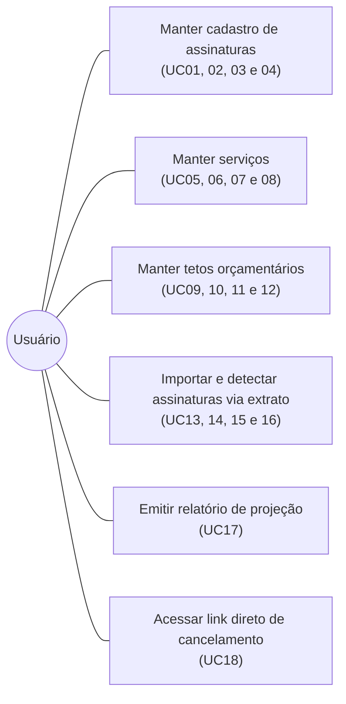

# Prototipagem SubTracker

**Integrantes:**
- Ronald Teixeira de Assis
- Rodrigo Américo Nascimento D'icarahy
- Thiago Souza da Silva
- Matheus Jasbick

## 1. Nome do Sistema e Declaração de Propósito

**Nome do Sistema:** SubTracker — Gestão Inteligente de Assinaturas, Detecção por Extrato e Otimização de Recorrências.

**Declaração de Propósito:** Automatizar a detecção de despesas recorrentes a partir de extratos bancários, centralizar o gerenciamento de serviços por assinatura contratados pelo usuário, monitorar tetos orçamentários por categoria e facilitar o cancelamento ou substituição de plano.

## 2. Business Case Simplificado

No cenário atual, a proliferação de serviços por assinatura (streaming de vídeo e música, academias, softwares de produtividade, armazenamento em nuvem e jogos) fragmenta as cobranças ao longo do mês. A maior parte dos usuários perde a visibilidade do montante total comprometido e é surpreendida por débitos automáticos recorrentes de ferramentas que não utiliza com frequência.

O SubTracker gera valor ao unificar todos os contratos em uma visão cronológica simples e previsível. Além disso, elimina o atrito de inserção manual permitindo a leitura e conciliação de extratos bancários (OFX/CSV), oferece controle de metas orçamentárias com alertas visuais de teto por categoria e combate barreiras burocráticas fornecendo links e orientações diretas para cancelamento junto aos provedores.

## 3. Processo de Negócio Principal

- **Importação e Detecção Automática:** O usuário realiza o upload do extrato bancário (OFX ou CSV); o sistema cruza as descrições dos lançamentos com o catálogo de provedores e apresenta uma lista de recorrências identificadas para confirmação em lote.
- **Seleção e Cadastro:** O usuário inicia a inclusão de uma assinatura selecionando o serviço desejado a partir de um catálogo pré-configurado ou criando um serviço personalizado.
- **Definição de Parâmetros Financeiros:** O usuário informa o valor contratado, a periodicidade (mensal, trimestral ou anual), a data da próxima cobrança, a categoria de custo e o método de pagamento.
- **Acompanhamento no Painel:** O sistema calcula as datas futuras de faturamento, organiza as assinaturas em ordem cronológica de vencimento no painel principal e exibe o consumo atual frente às metas orçamentárias de cada categoria.
- **Consulta e Histórico:** O usuário acessa os detalhes de cada assinatura para auditar o histórico de cobranças efetivadas, pausar o serviço ou editar dados.
- **Cancelamento no Provedor:** Caso opte por descontinuar um serviço, o usuário aciona o atalho oficial que o redireciona de forma direta para a área de cancelamento da plataforma.
- **Relatório de Impacto:** O sistema processa os valores e gera gráficos de distribuição de despesas por categoria, projeções mensais e o custo anual acumulado.

## 4. Entidades de Domínio

- Assinatura
- Serviço (Provedor/Plataforma)
- Categoria
- Extrato Importado
- Teto Orçamentário

## 5. Casos de Uso (Total: 18 Casos de Uso)

### Manutenção de Assinaturas
- **UC01:** Cadastrar Assinatura
- **UC02:** Consultar/Listar Assinaturas
- **UC03:** Atualizar Assinatura
- **UC04:** Excluir Assinatura

### Manutenção de Serviços
- **UC05:** Cadastrar Serviço
- **UC06:** Consultar Serviços Disponíveis
- **UC07:** Atualizar Dados do Serviço
- **UC08:** Excluir Serviço

### Gestão de Tetos Orçamentários
- **UC09:** Cadastrar Teto Orçamentário
- **UC10:** Consultar Tetos e Consumo Vigente
- **UC11:** Atualizar Teto Orçamentário
- **UC12:** Excluir Teto Orçamentário

### Importação de Extratos e Conciliação
- **UC13:** Fazer Upload de Extrato Bancário
- **UC14:** Detectar e Conciliar Lançamentos
- **UC15:** Consultar Histórico de Extratos
- **UC16:** Descartar Lançamento de Extrato

### Relatório e Otimização
- **UC17:** Emitir Relatório de Projeção e Impacto Financeiro Recorrente
- **UC18:** Acessar Tutorial e Link Direto de Cancelamento

## 6. Diagrama de Casos de Uso

## 7. Mapeamento das Telas e Anotações Técnicas (Mobile-First)

Abaixo estão as anotações explicativas numeradas para cada captura de tela anexada, organizadas no formato padrão do trabalho:

### Tela 1: Painel Principal / Início

- **Botão de Ação Rápida no Topo:** Botão superior "Importar Extrato" que direciona imediatamente para o fluxo de envio e leitura automática de arquivos bancários.
- **Card de Resumo Mensal:** Exibe o somatório total de gastos do mês atual (R$ 491,60), total de assinaturas ativas (5), assinaturas pausadas (1) e a data da cobrança mais próxima (05 de set.).
- **Painel de Metas por Categoria:** Barras de progresso horizontais com código de cores comparando os gastos vigentes em relação ao limite orçamentário configurado (Trabalho, Fitness, Streaming e Música).
- **Lista de Próximas Cobranças:** Cartões ordenados por proximidade de vencimento, contendo ícone do serviço, nome, categoria, dias restantes para o débito, valor e periodicidade. Clicar no cartão navega para a Tela de Detalhes.
- **Botão Flutuante de Adição (+):** Abre o fluxo em etapas para adicionar uma nova assinatura manual (leva à Tela de Escolha de Serviço).
- **Barra de Navegação Inferior:** Alterna entre as abas Início e Relatório.

### Tela 2: Escolha do Serviço

1. **Barra de Progresso:** Indica visualmente que o usuário está na primeira etapa (Passo 1 de 2) do fluxo de cadastro.
2. **Botão Voltar:** Cancela o fluxo atual e retorna ao Painel Principal.
3. **Grade de Seleção de Serviços:** Botões interativos com logotipos de serviços populares pré-configurados (Netflix, Spotify, Disney+, HBO Max, Adobe, GitHub Pro, Academia, PlayStation+) e a opção "Outro" para serviços personalizados. Selecionar um card avança para a tela de preenchimento dos detalhes.

### Tela 3: Formulário de Detalhes

1. **Cabeçalho do Serviço Selecionado:** Identifica o ícone e nome do serviço escolhido na etapa anterior.
2. **Campo de Valor:** Entrada monetária (R$) onde o usuário digita o custo da assinatura.
3. **Seletor de Periodicidade:** Botões de opção única para definir a frequência da renovação (Mensal, Trimestral, Anual).
4. **Campo de Próxima Cobrança:** Seletor de data para registrar o próximo dia de faturamento.
5. **Seletor de Categoria:** Pílulas de seleção de domínio (Streaming, Trabalho, Fitness, Música, Jogos, Outros).
6. **Forma de Pagamento e Botão de Salvar:** Define a forma de pagamento (Cartão de crédito, Pix, etc.) e botão principal "Salvar assinatura" que persiste os dados e redireciona ao Início.

### Tela 4: Detalhes da Assinatura e Histórico

1. **Cabeçalho de Status:** Exibe ícone, nome do serviço, categoria e uma tag de status ativa/pausada.
2. **Bloco de Informações Contratuais:** Grade com valor atual, periodicidade, data da próxima fatura e forma de pagamento cadastrada.
3. **Card de Projeção Anual:** Exibe o custo total projetado daquele serviço específico em um período de 12 meses (R$ 526,80).
4. **Lista de Histórico de Cobranças:** Registros cronológicos de pagamentos anteriores, com status (Pago), data de débito e valor cobrado.
5. **Ações de Gestão (Pausar e Editar):** Botão para suspender temporariamente a assinatura (sem excluí-la) e botão para abrir a edição dos valores e datas.
6. **Botão de Cancelamento Direto:** Botão em destaque "Cancelar no Provedor ↗" que redireciona o usuário diretamente para a página oficial de gerenciamento e cancelamento do serviço contratado.

### Tela 5: Relatório de Análise Financeira

1. **Cards Consolidados de Topo:** Exibe o total mensal em vigor (R$ 491,60) e a estimativa de impacto anual consolidado de todas as assinaturas ativas (R$ 5.899,20).
2. **Gráfico Donut por Categoria:** Gráfico circular acompanhado de legenda percentual dividindo o orçamento em Trabalho (66%), Fitness (18%), Streaming (11%) e Música (4%).
3. **Ranking de Maiores Gastos:** Lista numerada dos serviços mais caros em ordem decrescente (1º Adobe Creative, 2º Academia Smart, 3º Netflix).
4. **Resumo Financeiro:** Linhas de auditoria comparando o gasto deste mês, a projeção para o mês seguinte e o cálculo anual.

### Tela 6: Importar Extrato (Envio de Arquivo)

- **Botão Voltar:** Cancela o fluxo de importação e retorna ao Painel Principal.
- **Barra de Progresso:** Indica visualmente a etapa do processo de importação do arquivo.
- **Área de Dropzone / Upload:** Caixa interativa para arrastar e soltar ou tocar para selecionar o arquivo bancário do dispositivo.
- **Tags de Formatos Compatíveis:** Indica a compatibilidade exclusiva com os padrões .OFX e .CSV.

### Tela 7: Conciliação de Extrato (Assinaturas Detectadas)

- **Indicador de Arquivo Processado:** Exibe o nome do arquivo analisado ("Extrato de Teste - SubTr...") com selo de status "Analisado".
- **Contador de Ocorrências:** Mostra a quantidade de assinaturas periódicas encontradas na fatura ("3 assinaturas encontradas na sua fatura").
- **Lista de Seleção em Lote:** Cartões individuais com caixas de seleção (checkbox) para cada serviço detectado (Spotify, iCloud+, Canva Pro), apresentando a data de detecção, categoria sugerida e valor mensal.
- **Botão Confirmar e Monitorar:** Persiste os serviços marcados no banco de dados e atualiza o Painel Principal.
